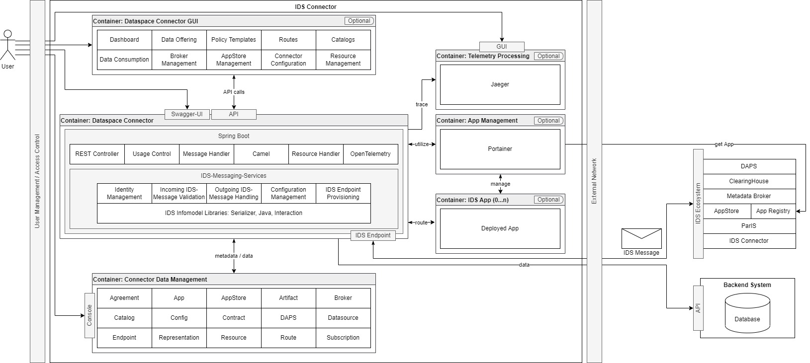

# Architecture
{: .fs-9 }

The container architecture of the entire IDS Connector is made up of several components. Some of them are optional. At the center is the Dataspace Connector itself (connector core) with its connector data management. Optionally, the Dataspace Connector GUI can be used. Jaeger can be connected for displaying collected OpenTelemetry data. For the integration of IDS-Apps into the connector infrastructure, Portainer can be used to load IDS-Apps from an IDS-AppStore-Registry and manage them in the infrastructure. The actual data can be located both locally and externally. External IDS-Ecosystem components can be reached via IDS-Messages.
{: .fs-6 .fw-300 }

[previous version](../v5/architecture.md)

---

